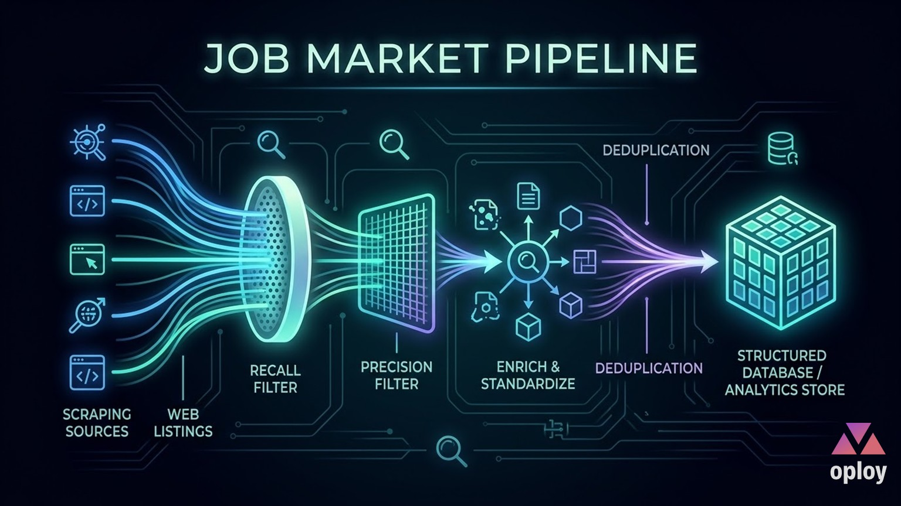
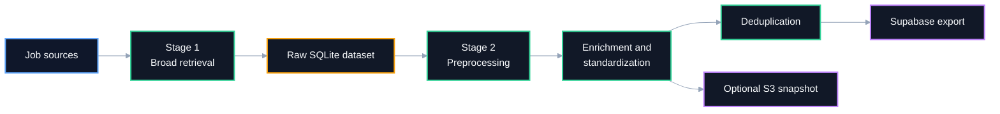
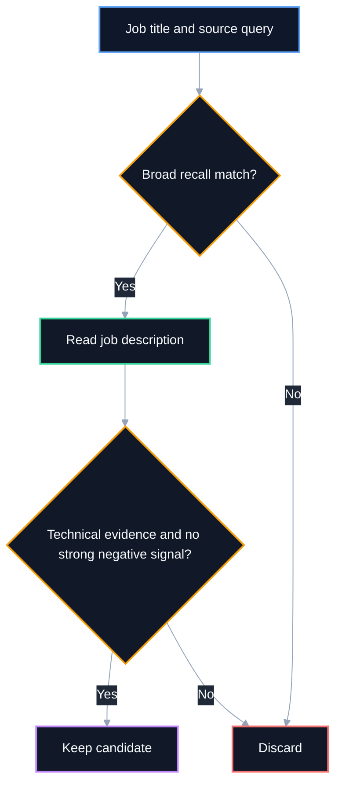
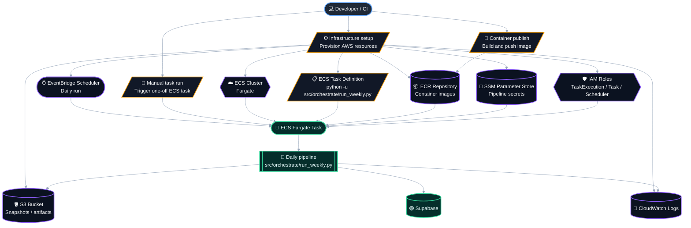
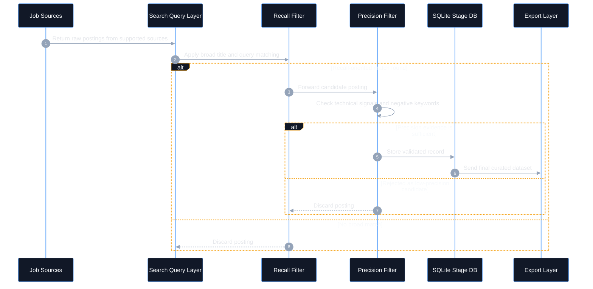

# Job Market Pipeline

<p align="center">
  <a href="https://job.oploy.eu">
    
  </a>
</p>


Reusable Python pipeline for collecting, filtering, standardizing, deduplicating, and exporting job postings.

> ⭐ If this project is useful for your work or research, consider starring the repository to support its visibility and future development.

This repository is prepared as a general-purpose job scraping pipeline. The current search profile is tuned to Optimization and Operations Research roles as a concrete example domain inspired by the public results visible on job.oploy.eu.

## Overview

The pipeline is designed around a practical retrieval principle:

- **Recall** means finding as many relevant jobs as possible.
- **Precision** means keeping the final dataset focused on truly relevant jobs.

To balance both, the scraper uses a two-stage filtering strategy:

1. **Stage 1: broad retrieval for recall**  
   Search terms and title keywords cast a wide net to avoid missing potentially relevant jobs.
2. **Stage 2: stronger validation for precision**  
   Description-level technical keywords and exclusion rules remove obvious false positives.

This is professionally useful because job titles are often noisy. A broad first pass reduces missed opportunities, while a stricter second pass improves dataset quality.

## Features

- Multi-stage pipeline from scraping to export
- Configurable country-based scraping
- Two-stage filtering strategy with negative keyword rejection
- Preprocessing and normalization of raw postings
- Enrichment and taxonomy standardization
- Deduplication before or after export
- Export workflow for Supabase
- Optional AWS snapshot support
- Docker-ready execution

## Architecture

The following two diagrams serve different purposes:

- **Pipeline architecture overview** shows the end-to-end data movement across the main processing stages.
- **Filtering logic overview** explains how the scraper balances recall and precision when deciding whether a job should be kept or discarded.

### 1. Pipeline architecture overview

This diagram explains the high-level system flow from source collection to final export.



### 2. Filtering logic overview

This diagram focuses only on the retrieval decision path. It shows how the pipeline first casts a broad net for recall, then applies stronger evidence checks to improve precision.



## Example domain profile

The repository is not limited to one profession, but the current default keyword profile is a realistic example for:

- Optimization
- Operations Research
- Supply Chain Analytics
- Mathematical Modeling
- Decision Science

Examples of technical evidence used in the current profile include terms such as `linear programming`, `mixed integer programming`, `Gurobi`, `CPLEX`, `OR-Tools`, and `vehicle routing`.

If you want to adapt the scraper to another domain, the main customization point is `1- Scrapped Data/job_scraper.py`.

## Pipeline stages

1. **Scraping**  
   Collect jobs from supported sources into a raw SQLite database.
2. **Preprocessing**  
   Clean text, normalize fields, and prepare the intermediate dataset.
3. **Enrichment and standardization**  
   Apply taxonomy mapping, relevance logic, and structured normalization.
4. **Deduplication**  
   Remove duplicates before or after export.
5. **Export**  
   Push the final dataset to Supabase.

## Project structure

```text
.
├── 1- Scrapped Data/
│   └── job_scraper.py
├── 2- Preprocessed/
│   └── preprocess.py
├── 3- Enrichment + Standardization/
│   ├── JOB_RELEVANCE_SCORE.md
│   └── taxonomy_standardization.py
├── 4- Deduplicate/
│   └── deduplicate_supabase.py
├── src/
│   ├── analysis/
│   ├── config/
│   ├── db/
│   ├── export/
│   ├── models/
│   └── orchestrate/
├── .env.example
├── .gitignore
├── AGENTS.md
├── Dockerfile
├── README.md
└── requirements.txt
```

## Recommended public repository name

Recommended GitHub repository name: **`job-market-pipeline`**

Alternative acceptable names:

- `job-scraping-pipeline`
- `job-market-scraper`
- `general-job-pipeline`

## Setup

### Prerequisites

- Python 3.11+
- pip
- Docker optional
- AWS CLI optional
- Supabase project optional unless export is needed

### Installation

```powershell
python -m venv .venv
.\.venv\Scripts\Activate.ps1
pip install -r requirements.txt
Copy-Item .env.example .env
```

Fill `.env` with your own credentials locally. Never commit it.

## Configuration

Main variables are documented in `.env.example`.

| Variable | Required | Description |
|---|---:|---|
| `SUPABASE_URL` | export only | Target Supabase project URL |
| `SUPABASE_SERVICE_ROLE_KEY` | export only | Server-side key for inserts and updates |
| `S3_BUCKET` | optional | Bucket for snapshots |
| `S3_PREFIX` | optional | Prefix for stored snapshot objects |
| `AWS_REGION` | optional | AWS region for snapshot operations |
| `SCRAPE_COUNTRIES` | optional | Comma-separated country list |
| `SCRAPE_MAX_JOBS` | optional | Maximum jobs per run or per country profile |
| `DAYS_BACK` | optional | Lookback window for recency filtering |
| `DRY_RUN` | optional | Run without pushing writes |
| `CLEAR_SUPABASE` | optional | Clear exported data before full refresh |

## Usage

### Run the scraper stage only

```powershell
python ".\1- Scrapped Data\job_scraper.py" --jobs 50 --countries "Germany,Netherlands"
```

### Run the full local pipeline

```powershell
python .\src\orchestrate\run_weekly.py --local
```

### Run a local dry run

```powershell
python .\src\orchestrate\run_weekly.py --local --dry-run
```

### Skip scraping and reuse an existing local database

```powershell
python .\src\orchestrate\run_weekly.py --local --skip-scrape
```

### Docker example

```powershell
docker build -t job-market-pipeline .
docker run --rm --env-file .env job-market-pipeline python src/orchestrate/run_weekly.py --local
```

## Professional filtering rationale

Many job datasets fail because they optimize only one metric:

- too much recall creates noisy datasets
- too much precision misses relevant postings

This project uses a practical compromise:

- **broad search terms** improve coverage
- **technical keyword validation** improves relevance
- **negative keywords** reduce misleading matches such as SEO or marketing optimization roles

For Optimization and Operations Research, this matters because many relevant jobs are not titled explicitly as `Operations Research Scientist`. They may appear as `Decision Scientist`, `Supply Chain Analyst`, `Optimization Engineer`, or `Applied Scientist` while still requiring mathematical optimization skills.

## What was cleaned for open-source publication

This repository version intentionally excludes:

- real secrets and connection strings
- local `.env` files
- generated SQLite databases
- backup databases
- internal run notes and one-off deployment artifacts
- internal prompt files not needed for public usage

## Appendix: deployment

Deployment is optional and intentionally placed near the end of this document so the main README stays focused on usage and pipeline behavior.

The project can be deployed as a **daily containerized pipeline** on AWS. In this setup, infrastructure prepares storage, secrets, logs, and compute; a container image is pushed to ECR; and an EventBridge schedule triggers a Fargate task once per day.

The script filename [`run_weekly.py`](job-market-pipeline/src/orchestrate/run_weekly.py:1) is historical, but it can still be used for a **daily** scheduled run.

### AWS deployment overview

This diagram shows the recommended public deployment pattern for this repository: provision infrastructure, publish the container, trigger tasks manually when needed, and run the pipeline automatically on a daily schedule.



### Deployment notes

- Use AWS only if you need automated scheduled runs.
- Use SSM Parameter Store for credentials instead of committing secrets.
- Use ECR for the pipeline container image built from [`Dockerfile`](job-market-pipeline/Dockerfile).
- Use CloudWatch Logs for operational visibility.
- Use EventBridge Scheduler for a **daily** trigger, not weekly.

## Appendix: retrieval sequence

The following sequence diagram is separated from the main architecture section to reduce visual overload while still documenting the retrieval logic in a more presentation-oriented format.



## License

This repository is licensed under the [`MIT License`](job-market-pipeline/LICENSE).

---

_Repository automation heartbeat: 2026-03-19 UTC_
